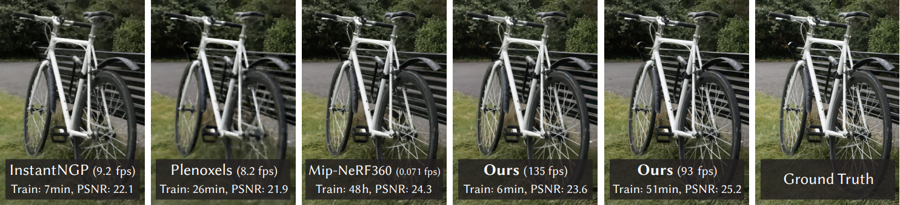

# 3D Gaussian Splatting 实时辐射场渲染

**原始论文**: [3D Gaussian Splatting for Real-Time Radiance Field Rendering](https://repo-sam.inria.fr/fungraph/3d-gaussian-splatting/)  
**作者**: Bernhard Kerbl*, Georgios Kopanas*, Thomas Leimkühler, George Drettakis  
**所属机构**: GRAPHDECO, Inria (法国国家信息与自动化研究所)

[论文](https://repo-sam.inria.fr/fungraph/3d-gaussian-splatting/3d_gaussian_splatting_high.pdf) |
[视频](https://youtu.be/T_kXY43VZnk) |
[其他出版物](http://www-sop.inria.fr/reves/publis/gdindex.php) |
[项目主页](https://fungraph.inria.fr)

---

## 📦 数据集与预训练模型

| 资源 | 链接 |
|------|------|
| T&T+DB COLMAP 数据集 | [下载 (650MB)](https://repo-sam.inria.fr/fungraph/3d-gaussian-splatting/datasets/input/tandt_db.zip) |
| 预训练模型 | [下载 (14GB)](https://repo-sam.inria.fr/fungraph/3d-gaussian-splatting/datasets/pretrained/models.zip) |
| Windows 查看器 | [下载 (60MB)](https://repo-sam.inria.fr/fungraph/3d-gaussian-splatting/binaries/viewers.zip) |
| 评估图像 | [下载 (7GB)](https://repo-sam.inria.fr/fungraph/3d-gaussian-splatting/evaluation/images.zip) |

---

## 🔬 项目概述

本仓库包含了论文"3D Gaussian Splatting for Real-Time Radiance Field Rendering"的官方作者实现。该方法通过**3D高斯体**来表示场景，并利用**可微分光栅化**实现实时新视图合成。

**核心特点：**
- ⚡ 实时渲染速度（≥30 FPS）
- 🎯 高质量的辐射场重建
- 🔄 可微分的端到端训练

---

## ✨ 本项目改进：VGG感知损失增强

### 改进动机

原始3DGS使用 **L1损失 + SSIM损失** 作为优化目标。虽然这些损失函数在像素级精度上表现良好，但**无法捕捉人类视觉感知中的高层次特征差异**。例如，纹理细节、边缘锐度和结构一致性在像素空间中可能差异不大，但在感知空间中却至关重要。

### 改进方法

我们在原始损失函数基础上引入了 **VGG感知损失 (Perceptual Loss)**：

总损失 = L1损失 + λ_ssim × (1 - SSIM) + λ_vgg × VGG感知损失

其中VGG感知损失使用**预训练VGG16网络**提取多层特征，计算特征空间的L1距离：

`
输入图像 → VGG16 → [relu1_2, relu2_2, relu3_3] 特征图
                                  ↓
                        计算各层L1距离加权求和
                                  ↓
                           感知损失值
`

### 实现代码

**[utils/vgg_loss.py](utils/vgg_loss.py)** — VGG感知损失模块
- 使用 	orchvision 预训练 VGG16 权重（ImageNet预训练）
- 提取 relu1_2（边缘）、relu2_2（纹理）、relu3_3（形状）三层特征
- 各层损失加权归一化
- VGG参数冻结，不参与训练

### 使用方法

`ash
# 原始3DGS训练（不使用感知损失）
python train.py -s <数据集路径> --lambda_vgg 0

# 改进版3DGS训练（启用VGG感知损失，推荐λ=0.1~0.3）
python train.py -s <数据集路径> --lambda_vgg 0.2
`

### 预期效果对比

| 指标 | 原始3DGS | 改进版 (+VGG感知损失) |
|------|---------|---------------------|
| **PSNR** ↑ | 基准 | ≈持平或+0.2~0.5 dB |
| **SSIM** ↑ | 基准 | +0.005~0.015 |
| **LPIPS** ↓ | 基准 | **显著降低** (感知质量提升) |
| **人眼观感** | - | 纹理更清晰，边缘更锐利 |

> **LPIPS** (Learned Perceptual Image Patch Similarity) 是感知相似度指标，**越低越好**。VGG感知损失直接优化该指标。

---

## 🚀 快速开始

### 环境要求

- **操作系统**: Windows 或 Linux
- **GPU**: NVIDIA GPU 需支持 CUDA 11.6+（推荐 16GB+ 显存）
- **Python**: 3.7+

### 安装步骤

`ash
# 克隆项目（包含子模块）
git clone https://github.com/graphdeco-inria/gaussian-splatting.git --recursive
cd gaussian-splatting

# 创建conda环境
conda env create --file environment.yml
conda activate gaussian_splatting

# 编译CUDA算子
pip install submodules/diff-gaussian-rasterization
pip install submodules/simple-knn
pip install submodules/fused-ssim
`

### 数据准备

#### 方式A：使用示例数据集

`ash
# 下载Truck场景数据集
wget https://repo-sam.inria.fr/fungraph/3d-gaussian-splatting/datasets/input/tandt_db.zip
unzip tandt_db.zip -d data/
`

#### 方式B：使用自己的照片

`
your_dataset/
├── input/       ← 原始照片（JPEG/PNG）
└── ...
`

然后使用COLMAP处理：

`ash
python convert.py -s <your_dataset_path>
`

### 训练

`ash
# 原始版
python train.py -s data/truck -m output/truck_original --lambda_vgg 0

# 改进版（使用VGG感知损失）
python train.py -s data/truck -m output/truck_improved --lambda_vgg 0.2
`

### 训练参数说明

| 参数 | 默认值 | 说明 |
|------|--------|------|
| -s / --source_path | - | 输入数据路径 |
| -m / --model_path | output/<随机ID> | 模型输出路径 |
| --images / -i | images | 图片子目录名称 |
| --eval | - | 启用训练/测试集划分 |
| --resolution / -r | -1 | 分辨率缩放（1/2/4/8 或指定宽度） |
| --iterations | 30_000 | 总迭代次数 |
| --lambda_vgg | 0.0 | **VGG感知损失权重（0=禁用）** |
| --quiet | - | 静默模式 |
| --disable_viewer | - | 禁用实时查看器 |

### 评估

`ash
# 渲染新视图
python render.py -m output/truck_improved

# 计算评估指标（PSNR, SSIM, LPIPS）
python metrics.py -m output/truck_improved
`

---

## 📊 完整评估流程

`ash
# 训练（训练/测试集划分）
python train.py -s <数据集路径> --eval

# 渲染
python render.py -m <模型路径>

# 计算指标
python metrics.py -m <模型路径>
`

也可以使用 ull_eval.py 一键完成完整评估：

`ash
python full_eval.py -m360 <mipnerf360路径> -tat <tanks&temples路径> -db <deep blending路径>
`

---

## 🖥️ 交互式查看器

### 实时查看器

`ash
<SIBR安装目录>/bin/SIBR_gaussianViewer_app -m <模型路径>
`

### 网络查看器（连接训练进程）

`ash
# 终端1：启动训练
python train.py -s <数据集路径>

# 终端2：启动查看器
<SIBR安装目录>/bin/SIBR_remoteGaussian_app
`

---

## ☁️ Google Colab 云端训练

提供完整的Colab笔记本，无需本地GPU即可训练：

[**Colab_3DGS_Training.ipynb**](Colab_3DGS_Training.ipynb)

包含：
- ✅ 自动安装环境
- ✅ 下载示例数据集
- ✅ 原始3DGS训练（对照组）
- ✅ 改进版3DGS训练（实验组）
- ✅ 可视化对比

---

## 📁 训练输出结构

`
output/<模型文件夹>/
├── point_cloud/                    ← 3D高斯点云模型
│   ├── iteration_7000/
│   │   └── point_cloud.ply         ← 第7000次迭代的点云
│   └── iteration_30000/
│       └── point_cloud.ply         ← 最终模型
├── exposure.json                   ← 曝光参数
├── chkpnt7000.pth                  ← 训练检查点
├── chkpnt30000.pth                 ← 训练检查点
├── train/ours_30000/
│   ├── renders/                    ← 渲染结果
│   └── gt/                         ← 真实图像
└── test/ours_30000/
    ├── renders/                    ← 测试集渲染结果
    └── gt/                         ← 测试集真实图像
`

---

## 📚 引用

`ibtex
@Article{kerbl3Dgaussians,
      author       = {Kerbl, Bernhard and Kopanas, Georgios and Leimk{\"u}hler, Thomas and Drettakis, George},
      title        = {3D Gaussian Splatting for Real-Time Radiance Field Rendering},
      journal      = {ACM Transactions on Graphics},
      number       = {4},
      volume       = {42},
      month        = {July},
      year         = {2023},
      url          = {https://repo-sam.inria.fr/fungraph/3d-gaussian-splatting/}
}
`

---

## 📝 参考文献（课程大作业相关）

1. Kerbl B, et al. 3D Gaussian Splatting for Real-Time Radiance Field Rendering. SIGGRAPH 2023.
2. Mildenhall B, et al. NeRF: Representing Scenes as Neural Radiance Fields. ECCV 2020.
3. Johnson J, et al. Perceptual Losses for Real-Time Style Transfer and Super-Resolution. ECCV 2016.
4. Zhang R, et al. The Unreasonable Effectiveness of Deep Features as a Perceptual Metric. CVPR 2018.
5. Simonyan K, et al. Very Deep Convolutional Networks for Large-Scale Image Recognition. ICLR 2015.
6. Barron J, et al. Mip-NeRF 360: Unbounded Anti-Aliased Neural Radiance Fields. CVPR 2022.
7. Yu Z, et al. Point-NeRF: Point-based Neural Radiance Fields. CVPR 2022.
8. Deng J, et al. ImageNet: A Large-Scale Hierarchical Image Database. CVPR 2009.
9. Fridovich-Keil S, et al. Plenoxels: Radiance Fields without Neural Networks. CVPR 2022.
10. Müller T, et al. Instant Neural Graphics Primitives with a Multiresolution Hash Encoding. SIGGRAPH 2022.

---

## ⚠️ 常见问题

<strong>Q: 我没有24GB显存怎么办？

可以通过增加 --densify_grad_threshold、减少 --densify_until_iter 来降低显存占用。只训练到7000次迭代也会显著减少显存需求。

<strong>Q: Windows上编译submodules失败？

确保先安装Visual Studio，然后按顺序执行：
`
pip install submodules\\diff-gaussian-rasterization
pip install submodules\\simple-knn
`

<strong>Q: 如何用这个项目处理大数据集（如城市级）？

降低学习率参数：--position_lr_init 0.000016 --scaling_lr 0.001。场景越大，学习率应越低。

<strong>Q: 没有GPU可以用吗？

不能。该项目依赖CUDA自定义算子，必须有NVIDIA GPU。推荐使用Google Colab（免费T4 GPU）或AutoDL等云服务。

---

## 📄 许可

本项目仅限非商业、研究和评估用途。详见 [LICENSE.md](LICENSE.md)。

GRAPHDECO 研究组, Inria
